# **Welcome** 👋

Below guide will help you to setup AI tools locally. If you feel you don't want to share your private data while using online AI tools, then you are at right place!

You will find enough information such that you can setup your environment to use AI locally.

# **A Quick Note**
By following below steps you will be able to set up local AI powered development environment using LM Studio inside Visual Studio Code Editor. 

If you are looking for other tutorials, feel free to refer to below guides...

- 🧑‍💻 [Setup Ollama with Roo Code Extension](README.md)
- 🧑‍💻 [Setup Ollama with Continue Extension](OLLAMA-WITH-CONTINUE-SETUP.md)
- 🧑‍💻 [Setup Opencode with Openrouter](OPENCODE-WITH-OPENROUTER-SETUP.md)

# **Prerequisites**
- ✅ A laptop or desktop with proper internet connection.
- ✅ Visual Studio Code Editor
- ✅ Desire to learn new and emerging Generative AI technologies.

# **System Requirements**

| Software & Hardware | Specification |
|---|---|
| OS | Windows 11 |
| RAM | 8GB or more |
| GPU | Not mandatory |
| Processor | Intel i5 latest generation or AMD Ryzen 5 |

## **Install LM Studio**

Install LM Studio by visiting [this link](https://lmstudio.ai/). Then click Download button. It's pretty straight-forward process.

## **Check whether LM Studio is installed properly**

Open your terminal, and run 

```bash
lms
``` 
You will see something similar as below, if Ollama installed properly.

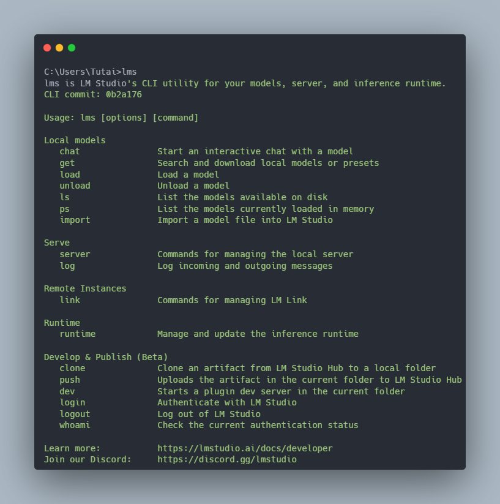

### Important note

If you don't prefer Command Line Interface, then no worries! LM Studio comes with a very user friendly Graphical User Interface.

---

## **Download local model in LM Studio for Local Use**

Here, as per the below screenshot we will download Qwen2.5 coder 1.5B variant with precision of F16, so that we don't lose any precision. If you have 16GB RAM it's good option for you. Otherwise, you can choose less precision options of same model i.e, 

- Open LM Studio and click on left sidebar's Model Search option as shown in screenshot below.


- Search **qwen2.5 coder 1.5B** when Model Search dialog box appears. Follow below steps as given in screenshot below to download the recommended model.

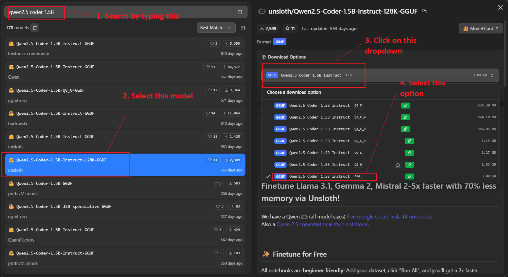

- Click Download button, when download is finished go to My Models, you will see something similar as shown below. You can see your downloaded model.


- Next, run below steps to run downloaded model. 

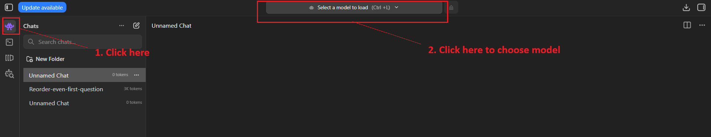

- Choose Qwen2.5 Coder 1.5B Instruct from the drop down.

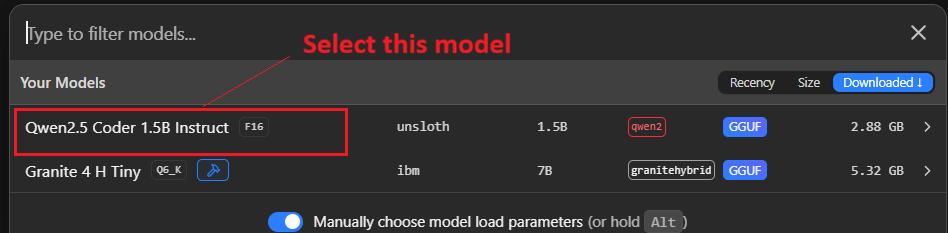

- Model settings popup will be visible. Increase context window, as per your requirement.

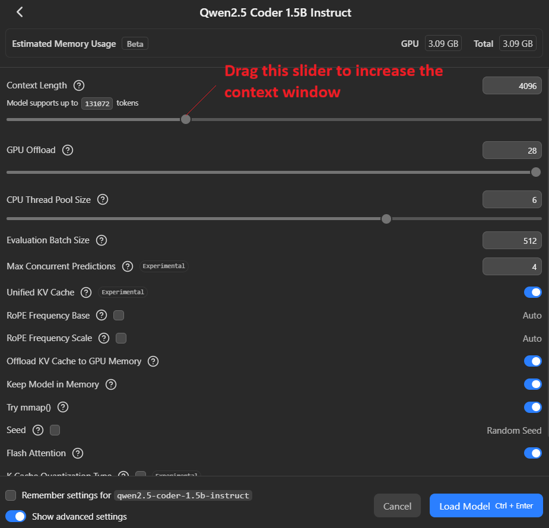

- For coding related tasks, it's better to set it at least 128k. As our downloaded model supports up to 128k context length, drag slider to the far right corner. Then click Load Model button.

- Model will load in memory, if you have GPU and model fits properly in GPU, it will load there only. Otherwise it loads in RAM.

When it's loading you can see below screenshot.

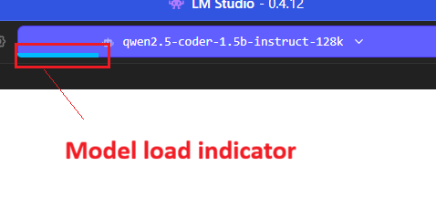

- After it's finished, you can start chatting it the model. Type **Hi** and you will see something as shown below.

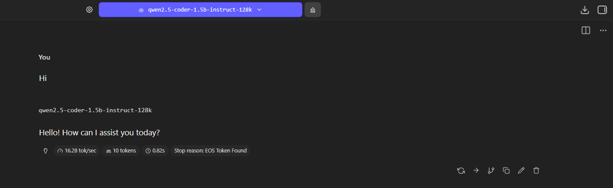

## **Configure LM Studio to Act as Local Inference Server**

 - Open LM Studio and then click on Developer option. 

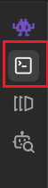

Developer panel will open, follow below steps to set LM Studio as local inference server. 

- Click Load Model button, then choose your downloaded model with the required context window specificed by you.

- Click the toggle button, to start Server.

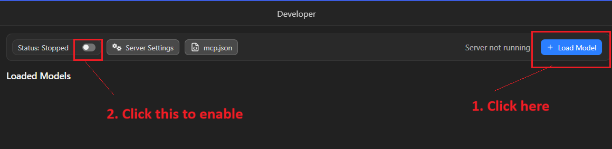

## **Install Visual Studio Code Extension**

Open Visual Studio Code and goto Extensions tab, search Roo code. Click Install button.

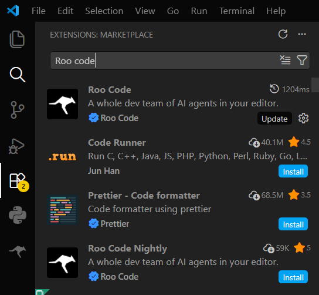

## **Configure Roo Code to Use LM Studio's Local Inference Server**

- Click Roo Code Icon inside VS Code, click it's Settings icon.

You will something similar as below.

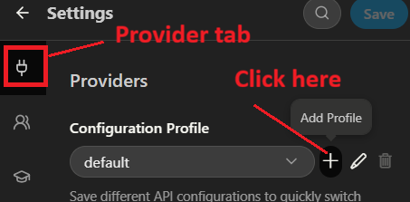

- Type LM-Studio and click Create Profile button.

- In API Provider section, type LM Studio in search text box and select matched option.

- Don't edit base URL, if you didn't modify default one.

- In Model drop-down, the model will be visible once you click the drop down. Otherwise check if you have enabled LM Studio to expose to network in LM Studio Developer Settings.

- When done, you will see something as shown below. Click Save button.

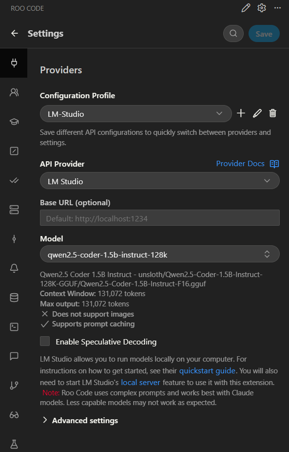

- Change the mode of interaction to **Ask** if it's anything othar than **Ask**. Also make sure LM-Studio profile is active in Roo Code panel inside Visual Studio Code.

## 🧪Testing The Setup

Type a simple prompt in Roo code and hit the Return key on keyboard or click plane icon.

```text
Hi, can you write javascript code to add two numbers.
```
Wait for some time. After waiting you will see response in visual studio code.

If you are curious about progress of your prompt, you can check Developer tab of LM Studio. As you can see in below screenshot. When it showing 100%, then you will start to see response inside Roo Code.

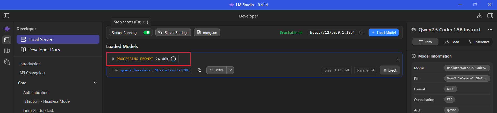
