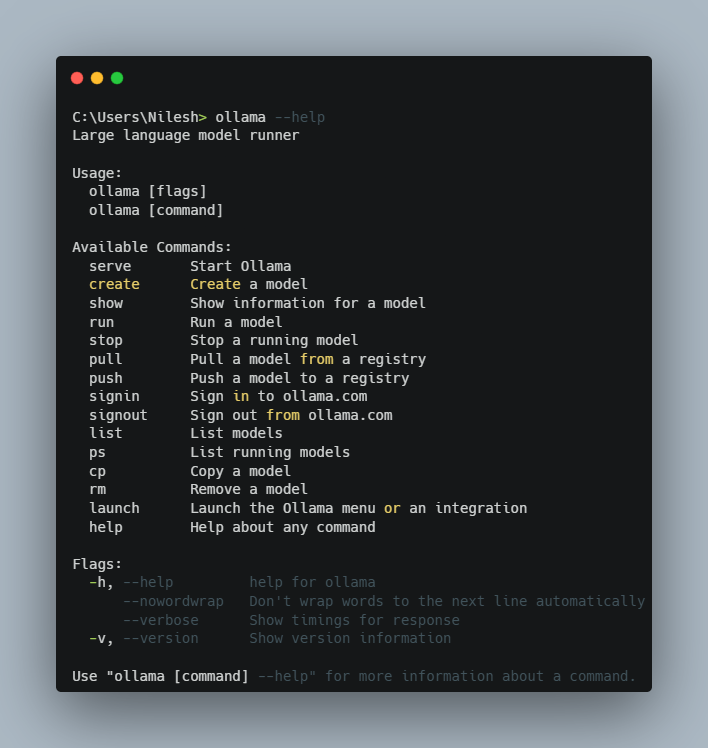
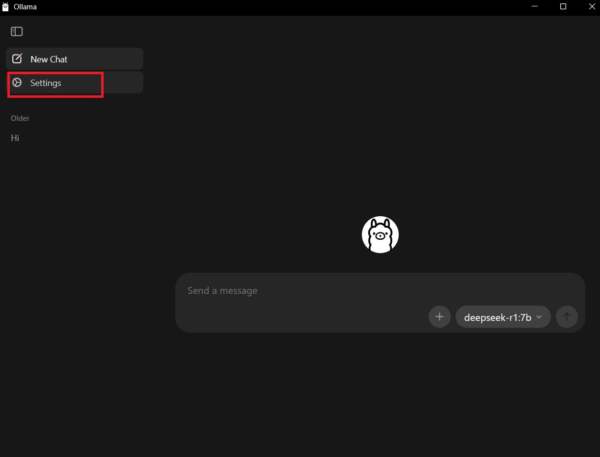
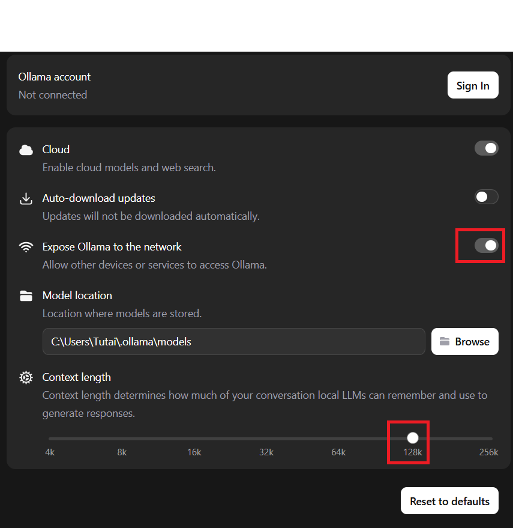
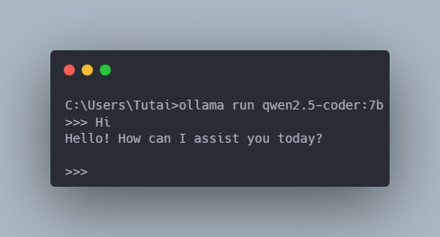
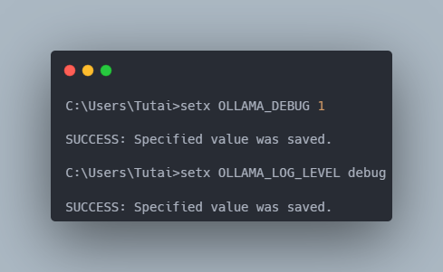
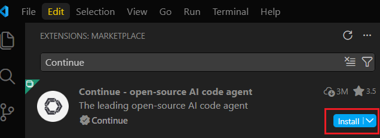
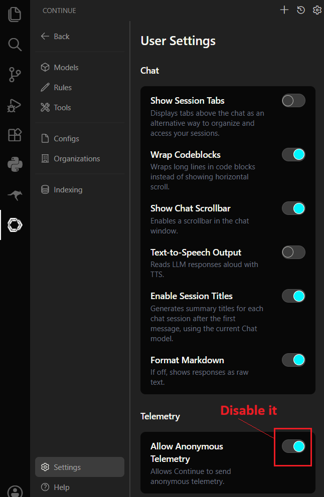
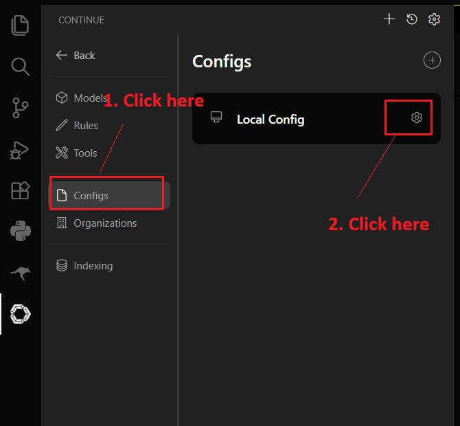
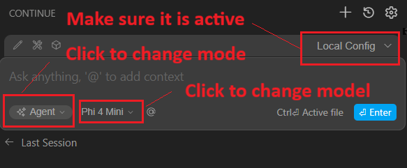
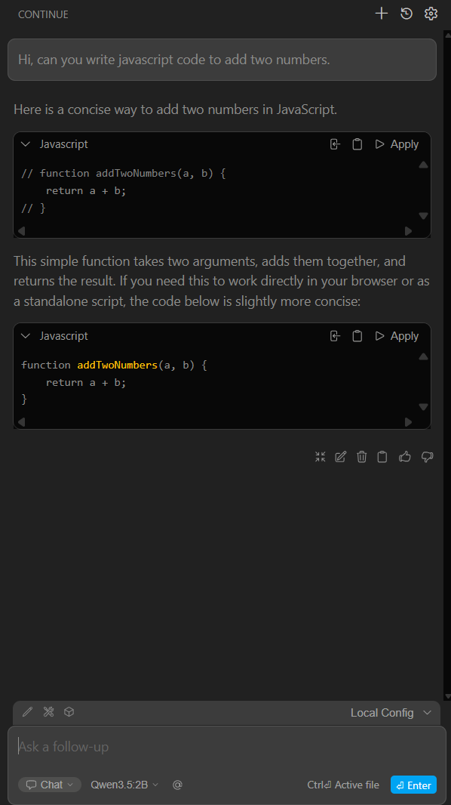

# **Welcome** 👋

Below guide will help you to setup AI tools locally. If you feel you don't want to share your private data while using online AI tools, then you are at right place!

You will find enough information such that you can setup your environment to use AI locally.

# **A Quick Note**
By following below steps you will be able to set up local AI powered development environment using Ollama inside Visual Studio Code Editor. 

If you are looking for other tutorials, feel free to refer to below guides...

- 🧑‍💻 [Setup LM Studio with Roo Code Extension](LM-STUDIO-WITH-ROO-SETUP.md)
- 🧑‍💻 [Setup Ollama with Roo Code Extension](README.md)
- 🧑‍💻 [Setup Opencode with Openrouter](OPENCODE-WITH-OPENROUTER-SETUP.md)

# **Prerequisites**
- ✅ A laptop or desktop with proper internet connection.
- ✅ Visual Studio Code Editor
- ✅ Desire to learn new and emerging Generative AI technologies.

# **System Requirements**

| Software & Hardware | Specification |
|---|---|
| OS | Windows 11 |
| RAM | 8GB or more |
| GPU | Not mandatory |
| Processor | Intel i5 latest generation or AMD Ryzen 5 |

## **Install Ollama**
Install Ollama by visiting [this link](https://ollama.com/). Then click Download button. It's pretty straight-forward process.

## **Check whether Ollama is installed properly**

Open your terminal, and run 

```bash
ollama --help
``` 
You will see something similar as below, if Ollama installed properly.


---

## **Download local model in Ollama for Local Use**

Here, the below command we will download Qwen2.5 coder 7B variant. If you have 16 GB RAM, it's more than enough for you. Otherwise, if you have 8GB RAM then you can choose any other variant which is less than 7B. 

```bash
ollama pull qwen3.5:2b
``` 

## **Check whether local model is properly downloaded**

```bash
ollama list
```

## **Configure Ollama to Act as Local Inference Server**

 ❇️ Open Ollama and then click on Settings option.



 ❇️ Click Expose Ollama to the Network toggle button. Also, increase context length as per your requirement.



 ❇️ Run Locally Downloaded Model inside Ollama

First, we need to know the model id to run, issue below command to do that.

```bash
ollama list
``` 
Next, run below command to run downloaded model. 

```bash
ollama run qwen3.5:2b
``` 
When it's running type "Hi". You will see something similar as below.



Type **/bye** to close the interaction session with the local llm.

Double check to ensure you're running the model currently, by issuing below command.

```bash
ollama ps
``` 

❇️ Set Environment Variables 

```bash
setx OLLAMA_DEBUG 1
setx OLLAMA_LOG_LEVEL debug
setx OLLAMA_CONTEXT_LENGTH 128000
``` 
You will something similar as below.



 ❇️ Run Ollama as local inference server

```bash
ollama serve
```
---

## **Install Visual Studio Code Extension**

Open Visual Studio Code and goto Extensions tab, search Continue. Click Install button.



## **Configure Continue to Use Ollama's Local Inference Server**

- Click Continue Icon inside VS Code, click it's Settings icon.

You will something similar as below.



- Click on Configs tab, then click on Cog wheel button.



- A **config.yaml** file will open in Visual Studio Code. Modify it's code as follows.

```yaml
name: qwen2.5-coder-3b-instruct
version: 0.0.5
schema: v1
models:
  - name: Qwen3.5:2B
    provider: ollama
    model: qwen3.5:2b
    apiBase: http://localhost:11434/
    roles:
      - apply
      - chat
      - edit
```

- Save this file and click Back button on Continue extension's panel.

- Now, follow below steps to set recently added configurations to use our local model inside Continue extension.



- Make sure "Chat" mode is selected and in Model Qwen3.5:2B is selected.

## 🧪Testing The Setup

Type a simple prompt in Roo code and hit the Return key on keyboard or click Enter button.

```text
Hi, can you write javascript code to add two numbers.
```
Wait for some time. After waiting you will see response in visual studio code.


