# **Welcome** 👋

Below guide will help you to setup AI tools locally. If you feel you don't want to share your private data while using online AI tools, then you are at right place!

You will find enough information such that you can setup your environment to use AI locally.

# **A Quick Note**
By following below steps you will be able to set up local AI powered development environment using Graphify inside Opencode agent.

# **Prerequisites**
- ✅ A laptop or desktop with proper internet connection.
- ✅ Visual Studio Code Editor
- ✅ Desire to learn new and emerging Generative AI technologies.
- ✅ You need to have Opencode installed in your system, if not please visit [Setup Opencode with Openrouter](OPENCODE-WITH-OPENROUTER-SETUP.md)

If you are looking for other tutorials, feel free to refer to below guides...

- 🧑‍💻 [Setup LM Studio with Roo Code Extension](LM-STUDIO-WITH-ROO-SETUP.md)
- 🧑‍💻 [Setup Ollama with Continue Extension](OLLAMA-WITH-CONTINUE-SETUP.md)
- 🧑‍💻 [Setup Opencode with Graphify](OPENCODE-WITH-GRAPHIFY-SETUP.md)

# **Prerequisites Before Installing Gitnexus**

| Software | Specification |
|---|---|
| Nodejs | Latest LTS version |

## **Install Gitnexus**

- Visit [this link](https://github.com/abhigyanpatwari/GitNexus) to get documentation on installing Gitnexus.

Open your terminal as Administrator, and run 

```bash
npm install -g gitnexus
``` 

## **Configure Local MCP Server to Allow Gitnexus To Generate Knowledge Graph**

- Create one __config.json__ with below contents in location "C:/Users/<UserName>/.opencode"

```json
{
    "mcp": {
        "gitnexus": {
            "type": "local",
                "command": ["gitnexus", "mcp"]
        }
    }
}
```

## **Setup Gitnexus Only For The First Time**

- Navigate to the project folder and type **gitnexus setup**"** to complete this step.

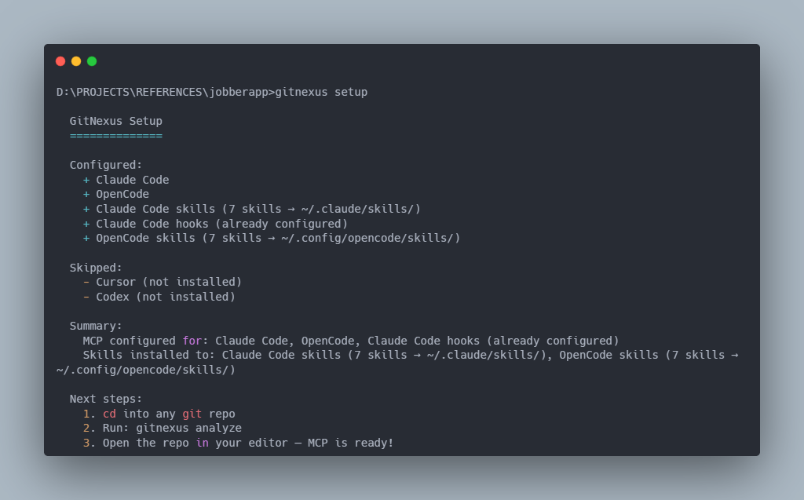

## **Analyze the Repo**

- In same location type **gitnexus analyze** to complete this step.

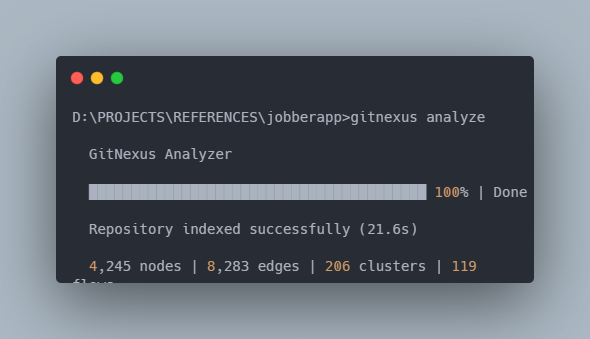

## **Make Sure To Run MCP Server Locally**

- In same location type **gitnexus mcp**"** to locally run the mcp server.

You will see something as shown below.

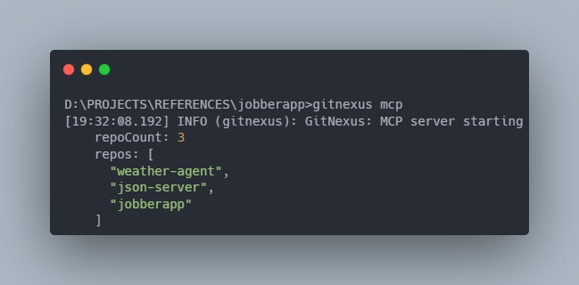

## **Run The Web UI To View The Knowledge Graph In Browser**

- Keep the MCP server running in one terminal and open another terminal in same location and type **gitnexus serve**"** to see the knowledge graph.

You will see something as shown below.

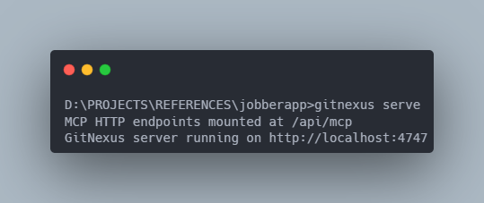

- Open the address mentioned in terminal and you will see something as below.

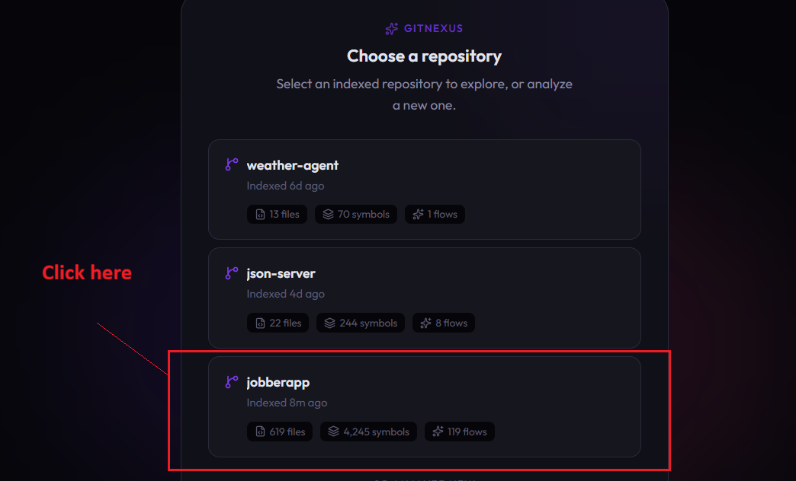

- Click on your project name and see the graph.

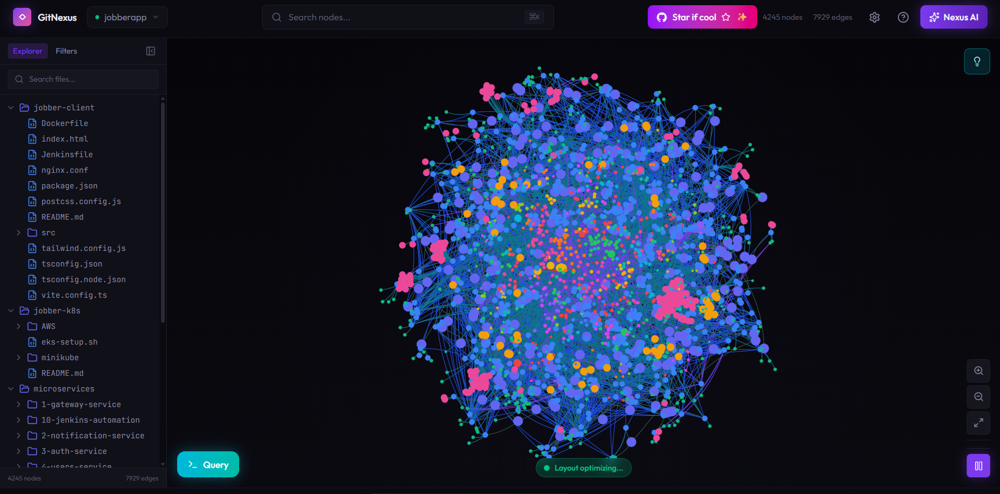

## **Asking Knowledge Graph To Better Understand Codebase**

- Run Opencode by issuing **opencode** command in the project location.

- Type **List available skills** inside opencode to verify that the skill is installed.

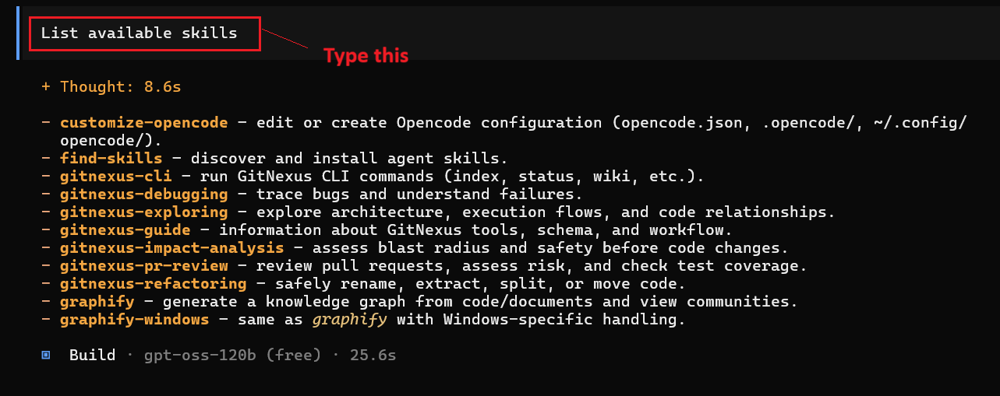

## 🧪Testing

### Test 1

- Let's explore the codebase type **Explain important high level modules of this project** to explore. If the codebase is large, you have to wait longer.

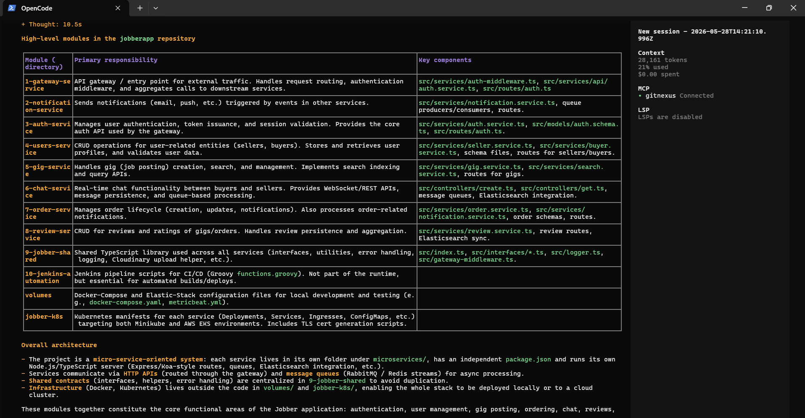

### Test 2

- Before this test, make sure you didn't close the two terminals where you were running local MCP server and web ui interface.

- Open browser and type **http://localhost:4747** and then select the project.

- Click **Settings** icon as per screenshot below. Also don't forget to select the model. For this time, I am selecting **OpenAI: gpt-oss-120b (free)**.

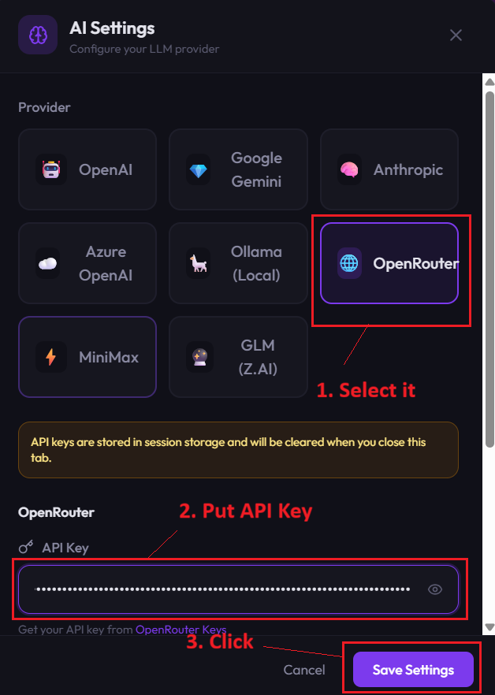

- Close the dialog box, by clicking **X** button.

- Click **Nexus AI** button and type query **Explain Auth Service flow of this project.** there.

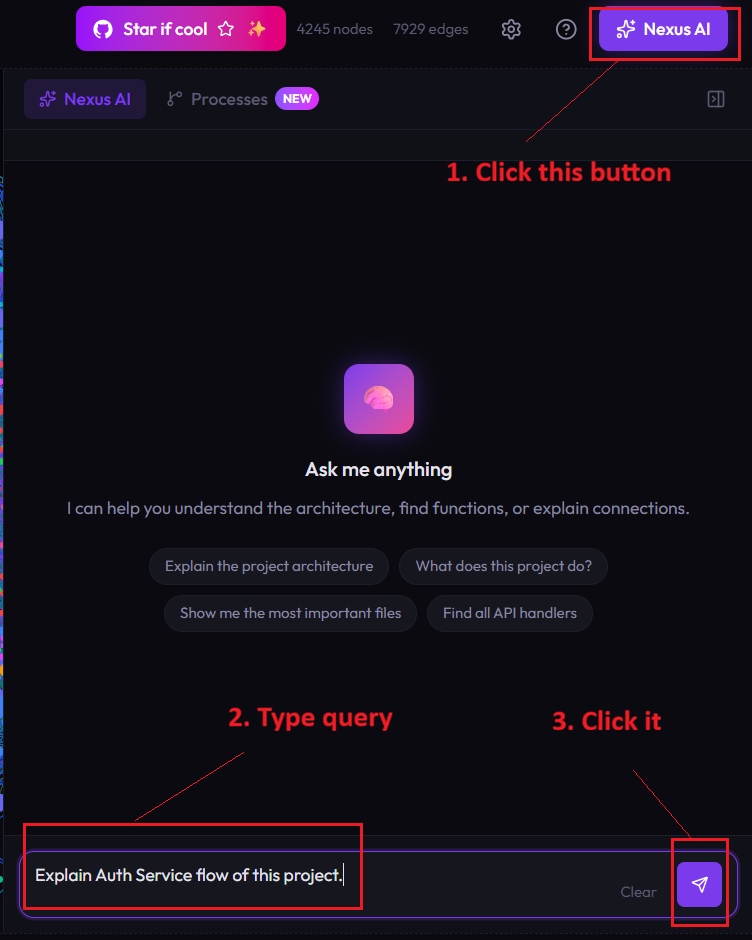

- Wait for some time and you will see something similar as shown below.

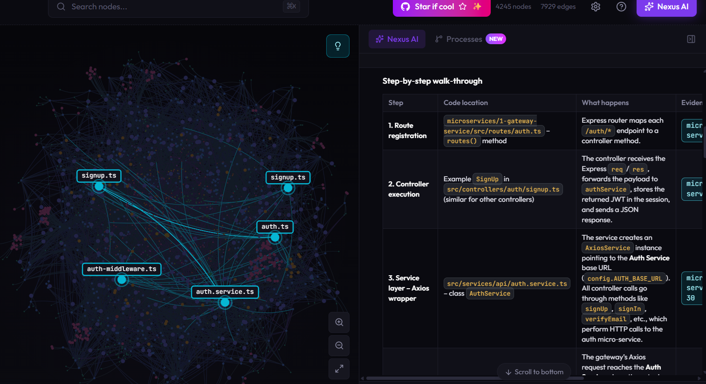

**Important Note** : The result depends on Model, if model is capable enough and has enough context window then it's very useful to get data about the knowledge graph. For this reason, we have selected GPT OSS 120B Free variant from Openrouter.

- Also, if you are not using browser, you can close one terminal which was showing web UI.

### Test 3

- We can also check about dependencies that can break our code, during code changes.

In opencode type **What will break if I modify Auth Service's Signup codes ?**.

You'll see something as shown below.

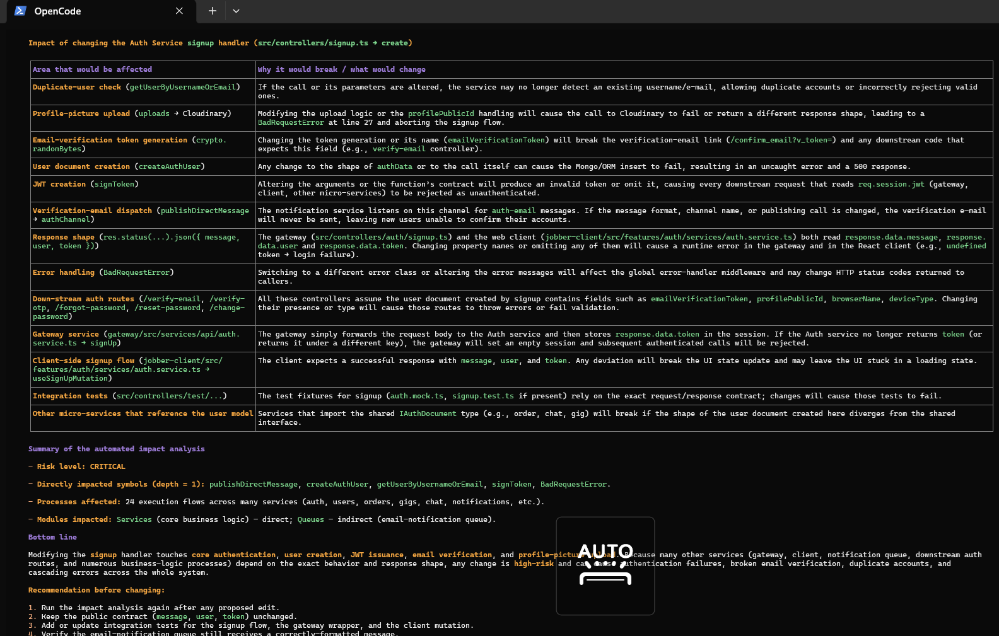


