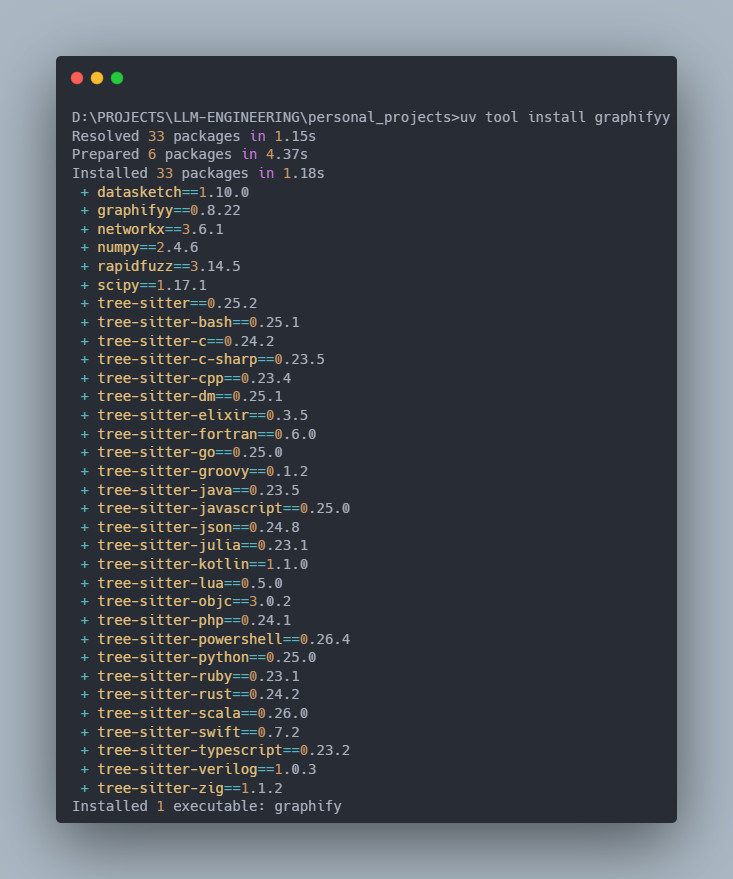
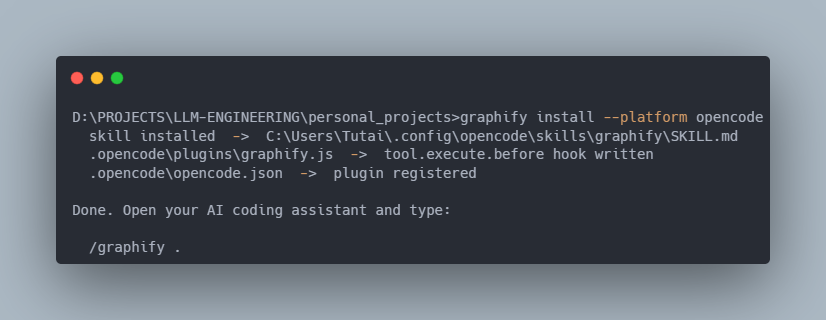
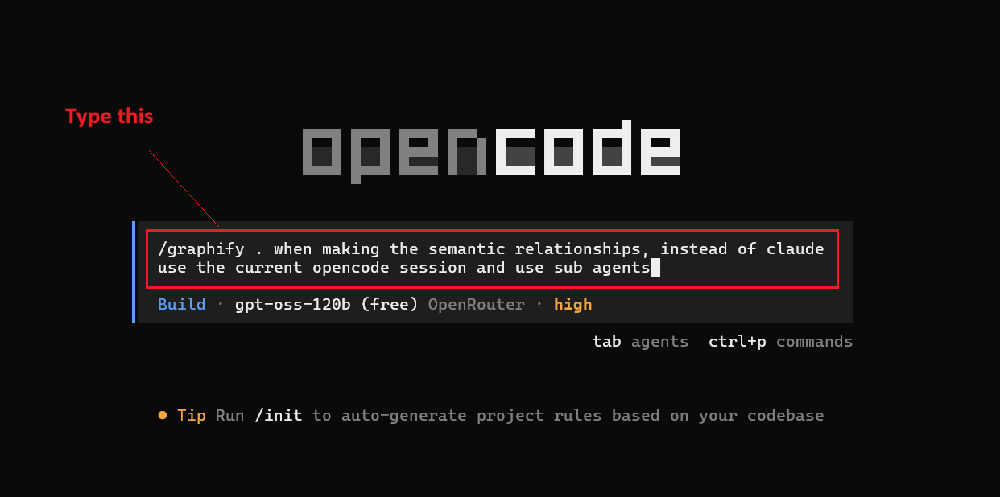
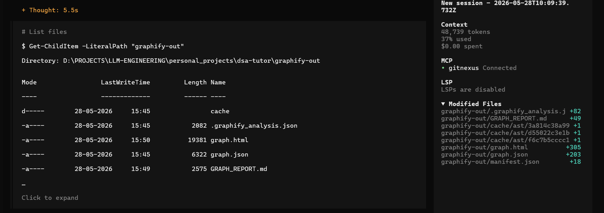
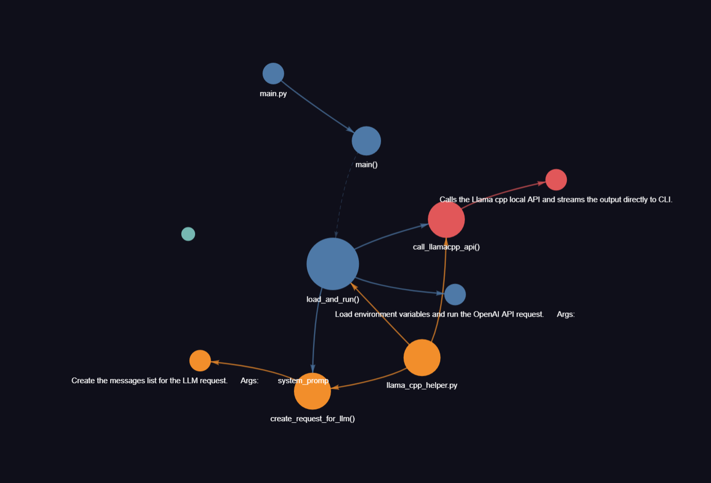
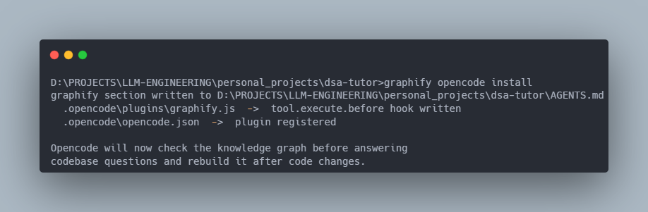
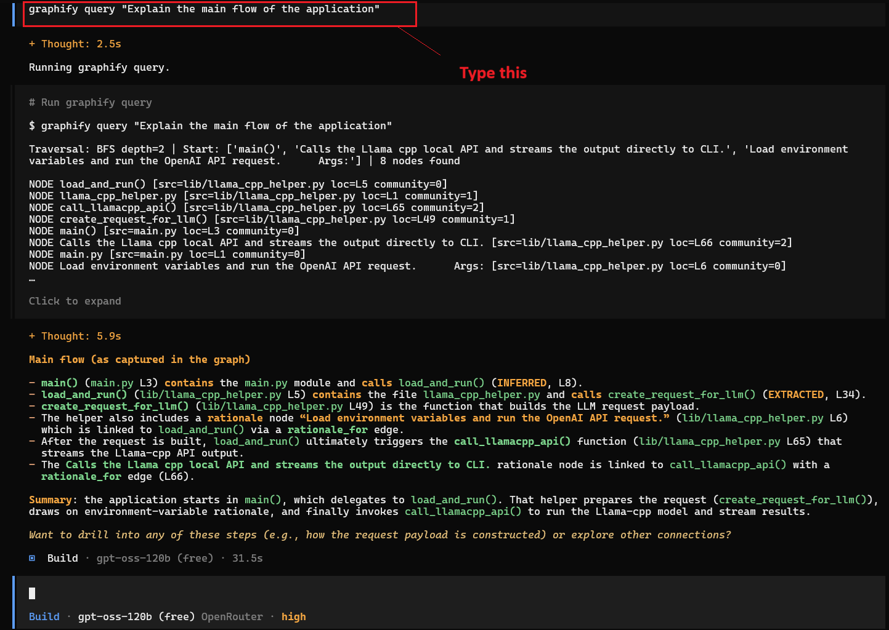

# **Welcome** 👋

Below guide will help you to setup AI tools locally. If you feel you don't want to share your private data while using online AI tools, then you are at right place!

You will find enough information such that you can setup your environment to use AI locally.

# **A Quick Note**
By following below steps you will be able to set up local AI powered development environment using Graphify inside Opencode agent.

# **Prerequisites**
- ✅ A laptop or desktop with proper internet connection.
- ✅ Visual Studio Code Editor
- ✅ Desire to learn new and emerging Generative AI technologies.
- ✅ You need to have Opencode installed in your system, if not please visit [Setup Opencode with Openrouter](OPENCODE-WITH-OPENROUTER-SETUP.md)

If you are looking for other tutorials, feel free to refer to below guides...

- 🧑‍💻 [Setup LM Studio with Roo Code Extension](LM-STUDIO-WITH-ROO-SETUP.md)
- 🧑‍💻 [Setup Ollama with Continue Extension](OLLAMA-WITH-CONTINUE-SETUP.md)
- 🧑‍💻 [Setup Opencode with Gitnexus](OPENCODE-WITH-GITNEXUS-SETUP.md)

# **System Requirements**

| Software & Hardware | Specification |
|---|---|
| OS | Windows 11 |
| RAM | 8GB or more |
| GPU | Not mandatory |
| Processor | Intel i5 latest generation or AMD Ryzen 5 |

# **Prerequisites Before Installing Graphify**

| Software | Specification |
|---|---|
| Python | 3.10+ |
| uv | any |

## **Install Graphify**

- Visit [this link](https://github.com/safishamsi/graphify) to get documentation on installing Graphify.

Open your terminal, and run 

```bash
uv tool install graphifyy
``` 
You will see something similar as below, if Graphify installed properly.



## **Register Graphify with Opencode**

Run below command in terminal...

```bash
graphify install --platform opencode
```
You will see something similar as below,



## **Running Graphify to Generate Knowledge Graph in Opencode**

- Make sure to run opencode agent inside a project folder.

- Navigate to project folder and type **opencode** in that location.

- Then in the terminal, type below as shown in the screenshot.



- Wait for some time. After it is finished, you will see something as shown below.



- Also, you will notice a HTML file is generated and after opening that you will see the graph of your project.



__Note__ : The project for which I generated graph was pretty small project.

## **Making Sure Graphify is Used By Opencode Everytime**

- Run **graphify opencode install** in the terminal outside of opencode.



- After running above command, it will create an AGENTS.md file in your project and it will also register graphify plugin for your project.

## 🧪Testing

### Test 1


### Test 2


