# **Welcome** 👋

Below guide will help you to setup AI tools locally. If you feel you don't want to share your private data while using online AI tools, then you are at right place!

You will find enough information such that you can setup your environment to use AI locally.

# **A Quick Note**
By following below steps you will be able to set up local AI powered development environment using a coding agent for working on coding tasks. 

If you are looking for other tutorials, feel free to refer to below guides...

- 🧑‍💻 [Setup LM Studio with Roo Code](LM-STUDIO-WITH-ROO-SETUP.md)
- 🧑‍💻 [Setup Ollama with Roo Code](README.md)
- 🧑‍💻 [Setup Ollama with Continue](OLLAMA-WITH-CONTINUE-SETUP.md)
- 🧑‍💻 [Setup Opencode with Graphify](OPENCODE-WITH-GRAPHIFY-SETUP.md)
- 🧑‍💻 [Setup Opencode with Gitnexus](OPENCODE-WITH-GITNEXUS-SETUP.md)

# **Prerequisites**
- ✅ A laptop or desktop with proper internet connection.
- ✅ Latest LTS version of Nodejs installed. (Visit [this link](https://nodejs.org/en))
- ✅ Visual Studio Code Editor (optional)
- ✅ Open Router Account (Visit [this link](https://openrouter.ai/) to create an account)
- ✅ Desire to learn new and emerging Generative AI technologies.

# **System Requirements**

| Software & Hardware | Specification |
|---|---|
| OS | Windows 11 |
| RAM | Anything works fine |
| GPU | Not mandatory |
| Processor | Anything works fine |

## **Install Opencode**
Install Opencode by running below command in terminal in administrator mode. It's pretty straight-forward process.

```bash
npm install -g opencode-ai
``` 

## **Generate API Token in Openrouter**

- Log into your Open router account, and then click on Preferences dropdown option.

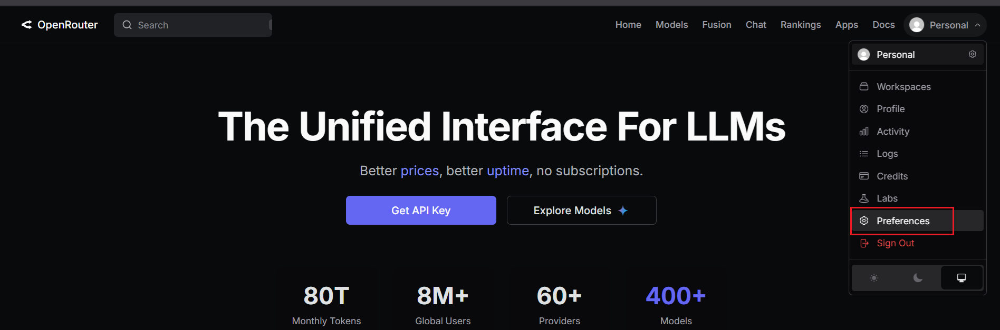

- Click on API Keys section in left sidebar.

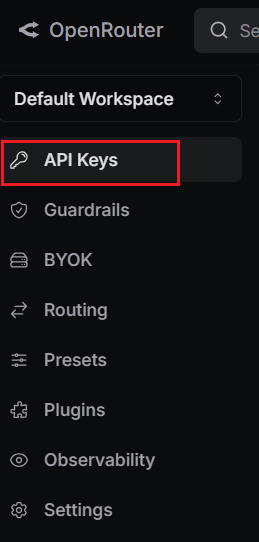

- Click on **New Key** button. Create Key dialog will appear.

- Type name and click **Create** button. Save the generated API key somewhere safely. You will need it later.

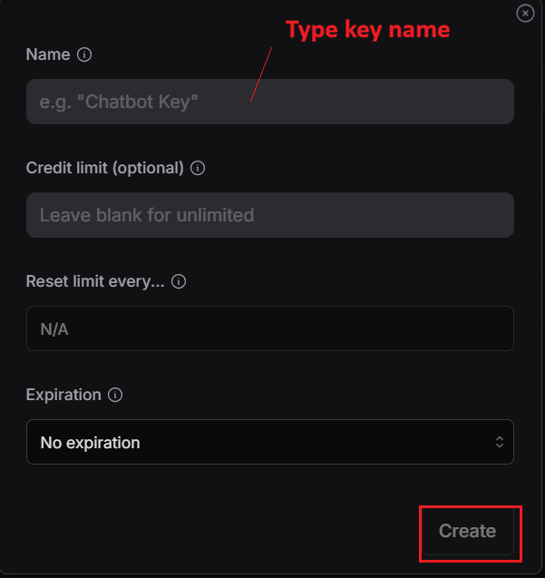

## **Launch Opencode in terminal**

- Navigate to project folder then open terminal in that location. Finally type **opencode** in the same location.
  You will see something similar as below.

  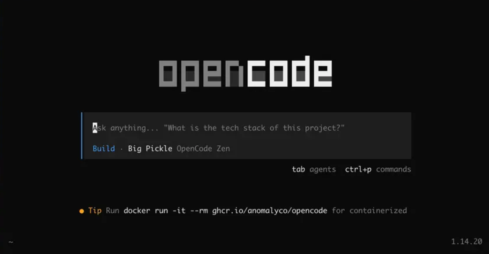

## **Configuring Inference Provider**

- Type **/connect** and select that option by hitting Enter key on your keyboard.

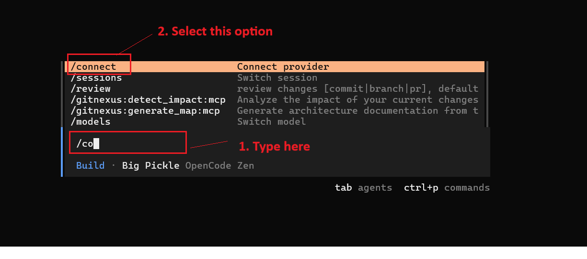

- Type **openrouter** and select that option by hitting Enter key on your keyboard.

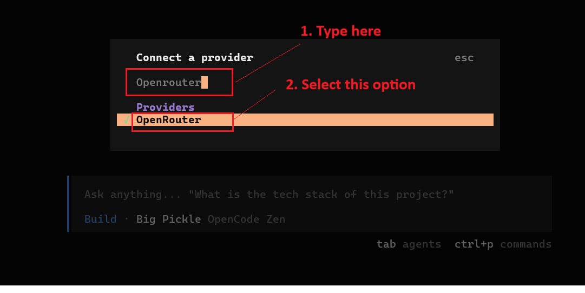

- Now, paste the API key which you copied earlier from your Openrouter account and press Enter key on your keyboard.

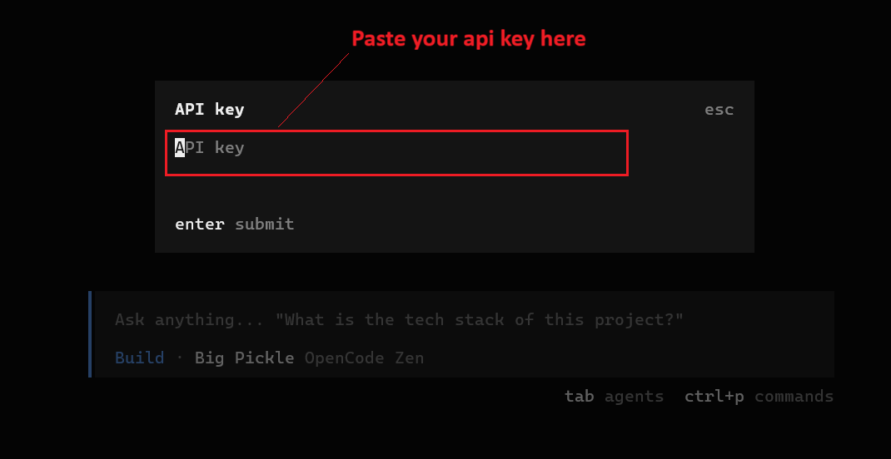

- When done, you will something as shown below. Ignore any errors or warnings after submitting the API key.

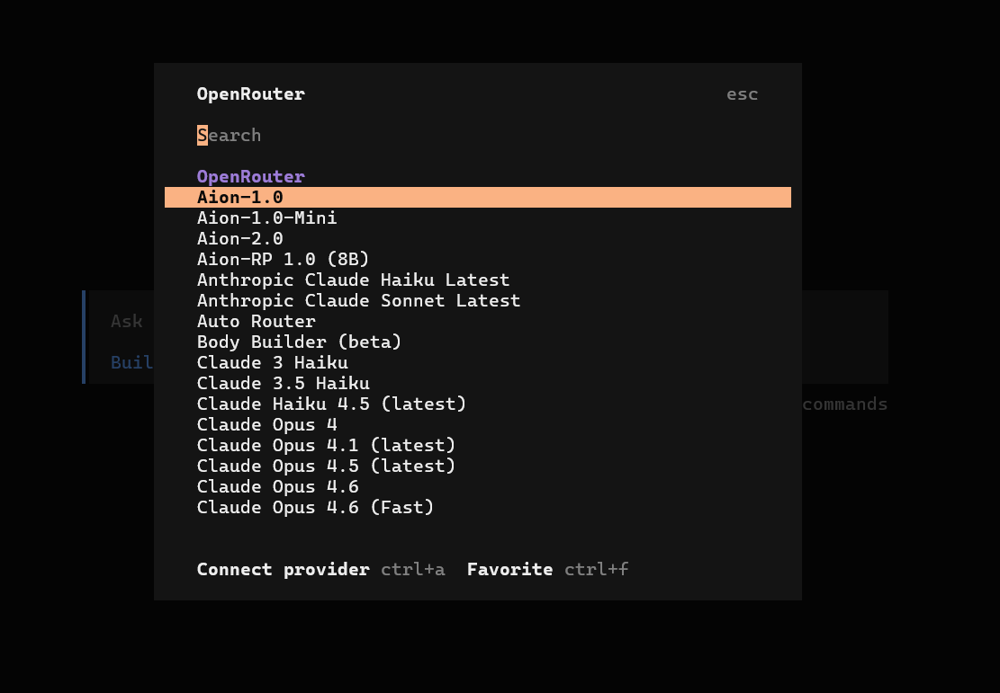

- From the list of models, we are interested only in free models, to get list of free models. Visit [this link to get the list of models](https://openrouter.ai/models)

- Follow below steps to see list of free models.

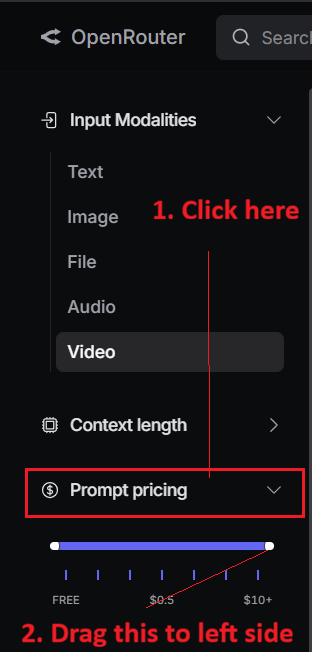

- Click to expand **Categories** and select **Programming** to sort free models for programming related tasks.

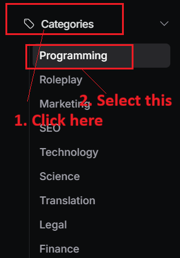

- Choose any model you like, for the time of writing this guide, I am selecting **Minimax M2.5** model. When you are following this tutorial, this model might not be free for you.

- Click on the model to view it's details. Take note of the model's provider.

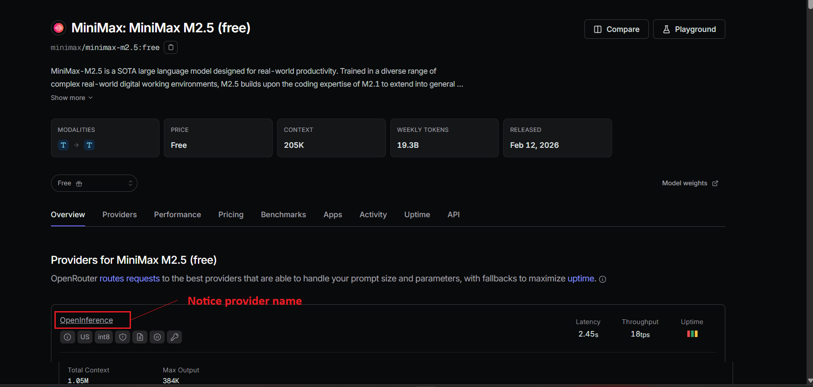

- Visit [privacy settings page](https://openrouter.ai/settings/privacy) of your account and scroll down to see the **Allowed Providers** section.

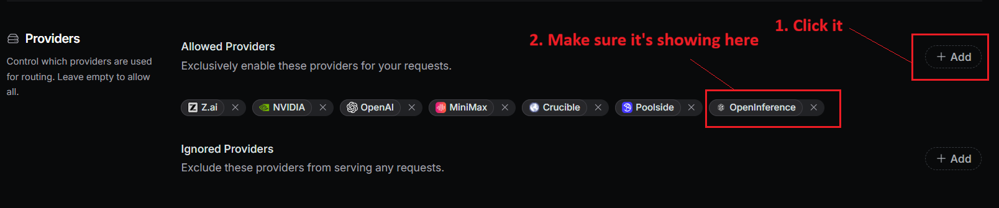

- Now come back to terminal where you already running opencode. Follow below steps to select **Minimax M2.5** model which is freely available.

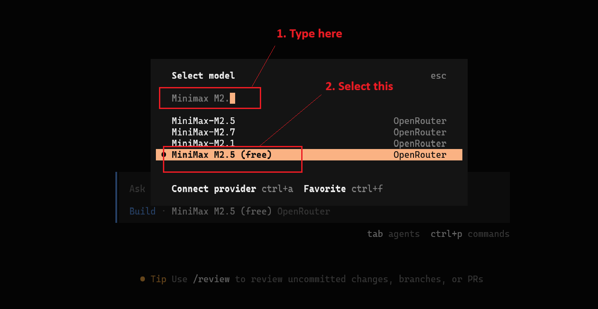

## 🧪Testing The Setup

Type a simple prompt in terminal and hit the Enter key on keyboard.

```text
Hi, can you write javascript code to add two numbers.
```
- You will see below screen, wait for some time to complete the agent's task.

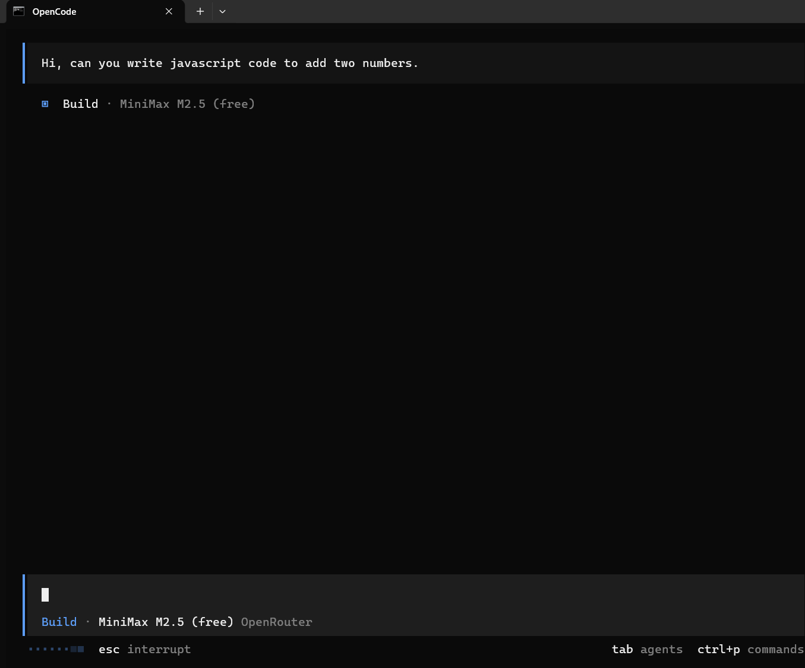

- Then I got below response, as shown below.

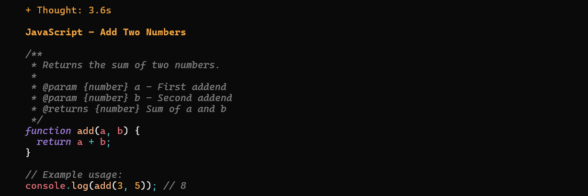

