# **Welcome** 👋

Below guide will help you to setup AI tools locally. If you feel you don't want to share your private data while using online AI tools, then you are at right place!

You will find enough information such that you can setup your environment to use AI locally.

# **A Quick Note**
By following below steps you will be able to set up local AI powered development environment using Ollama inside Visual Studio Code Editor. 

If you are looking for other tutorials, feel free to refer to below guides...

- 🧑‍💻 [Setup LM Studio with Roo Code Extension](LM-STUDIO-WITH-ROO-SETUP.md)
- 🧑‍💻 [Setup Ollama with Continue Extension](OLLAMA-WITH-CONTINUE-SETUP.md)
- 🧑‍💻 [Setup Opencode with Openrouter](OPENCODE-WITH-OPENROUTER-SETUP.md)
- 🧑‍💻 [Setup Opencode with Graphify](OPENCODE-WITH-GRAPHIFY-SETUP.md)

# **Prerequisites**
- ✅ A laptop or desktop with proper internet connection.
- ✅ Visual Studio Code Editor
- ✅ Desire to learn new and emerging Generative AI technologies.


# **System Requirements**

| Software & Hardware | Specification |
|---|---|
| OS | Windows 11 |
| RAM | 8GB or more |
| GPU | Not mandatory |
| Processor | Intel i5 latest generation or AMD Ryzen 5 |

## **Install Ollama**
Install Ollama by visiting [this link](https://ollama.com/). Then click Download button. It's pretty straight-forward process.

## **Check whether Ollama is installed properly**

Open your terminal, and run 

```bash
ollama --help
``` 
You will see something similar as below, if Ollama installed properly.


---

## **Download local model in Ollama for Local Use**

Here, the below command we will download Qwen2.5 coder 7B variant. If you have 16 GB RAM, it's more than enough for you. Otherwise, if you have 8GB RAM then you can choose any other variant which is less than 7B. 

```bash
ollama pull qwen2.5-coder:7b
``` 

## **Check whether local model is properly downloaded**

```bash
ollama list
```

You will see something similar as below.

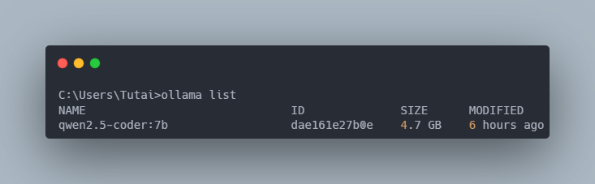
---

## **Configure Ollama to Act as Local Inference Server**

 ❇️ Open Ollama and then click on Settings option.


 ❇️ Click Expose Ollama to the Network toggle button. Also, increase context length as per your requirement.


 ❇️ Run Locally Downloaded Model inside Ollama

First, we need to know the model id to run, issue below command to do that.

```bash
ollama list
``` 


Next, run below command to run downloaded model. 

```bash
ollama run qwen2.5-coder:7b
``` 
When it's running type "Hi". You will see something similar as below.


Type **/bye** to close the interaction session with the local llm.

Double check to ensure you're running the model currently, by issuing below command.

```bash
ollama ps
``` 
You will something as below.

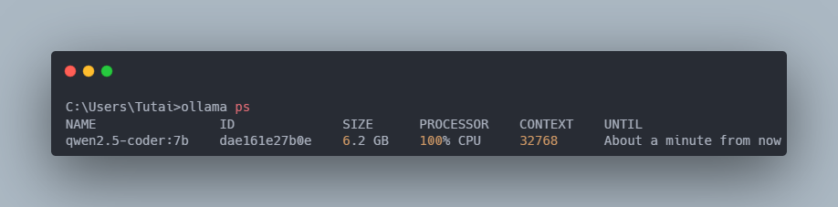

 ❇️ Set Environment Variables 

```bash
setx OLLAMA_DEBUG 1
setx OLLAMA_LOG_LEVEL debug
setx OLLAMA_CONTEXT_LENGTH 128000
``` 
You will something similar as below.


 ❇️ Run Ollama as local inference server

```bash
ollama serve
```
---

## **Install Visual Studio Code Extension**

Open Visual Studio Code and goto Extensions tab, search Roo code. Click Install button.


## **Configure Roo Code to Use Ollama's Local Inference Server**

- Click Roo Code Icon inside VS Code, click it's Settings icon.

You will something similar as below.


- Type Ollama and click Create Profile button.

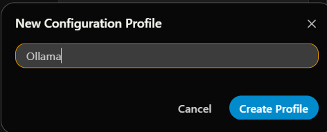

- In API Provider section, type Ollama in search text box and select Ollama option.

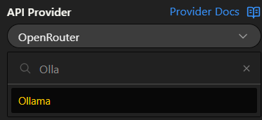

- Don't edit base URL, if you didn't modify default one.

- In Model drop-down, the model will be visible once you click the drop down. Otherwise check if you have enabled Ollama to expose to network in Ollama Settings.

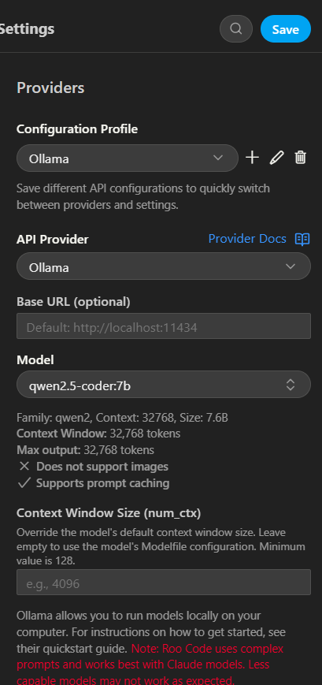

- Click **Save** button.

- Also, increase context length inside Roo Code as per your Ollama setup.

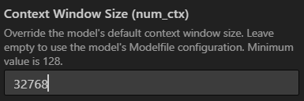

All done so far! Just make sure newly created **Ollama** profile is active in Roo code extension.

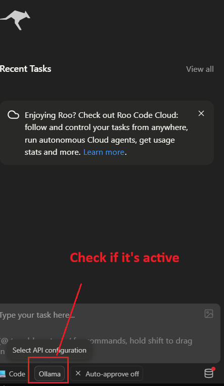

Change the mode of interaction to **Ask** if it's anything othar than **Ask**.

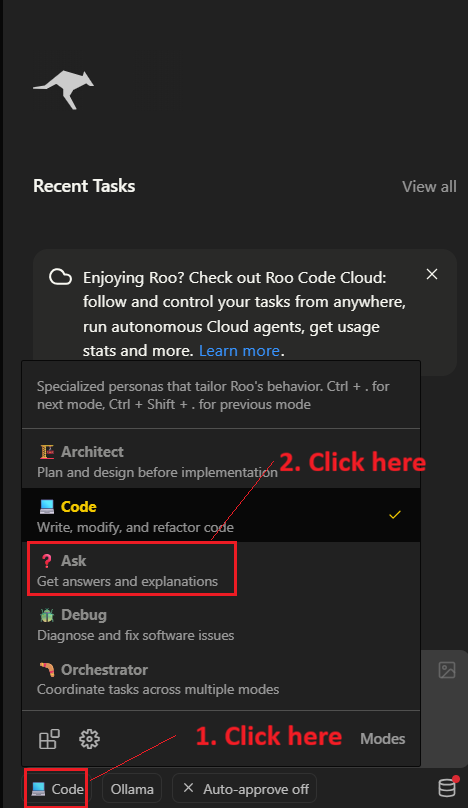

## 🧪Testing The Setup

Type a simple prompt in Roo code and hit the Return key on keyboard or click plane icon.

```text
Hi, can you write javascript code to add two numbers.
```

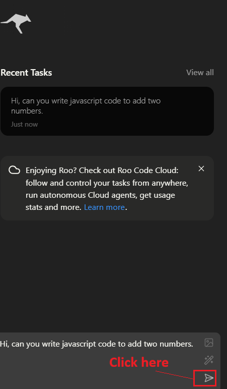

Wait for some time. After waiting you will see response in visual studio code.

## **Important Note**

While using Qwen2.5 Coder 7B in this setup, I got memory exhausted error from Roo. So, I tried with different variant of same model i.e, 1.5B variant's Q8 precision.

I did that using below ollama command

```bash
ollama pull qwen2.5-coder:1.5b-instruct-q8_0
```
But, it resuled errors similar to one shown below.

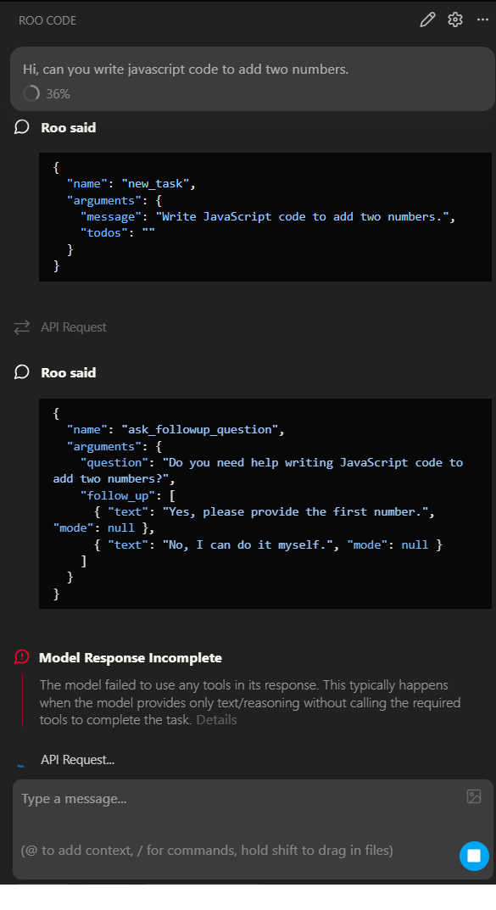

Then I tried a different model Qwen3.5 2B variant.

```bash
ollama pull qwen3.5:2b
```

Then I got good response, as shown below.

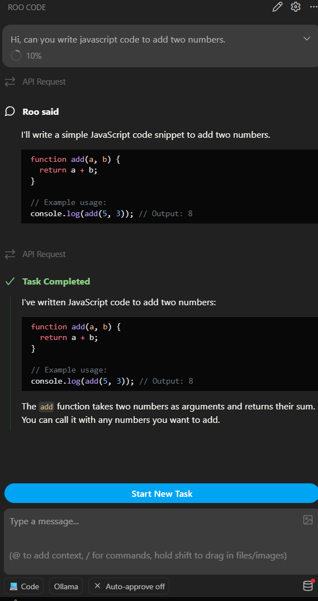

## 📒Lesson Learnt After This Experiment

Not every local AI model with smaller variant (2B, 1.5B) is capable of running tool calls. It depends on the model architecture and model features mostly. That's why Qwen2.5 Coder's 1.5B variant was unable to perform the prompt instructions. Although, Qwen3.5 2B variant was able to follow the instructions clearly.

